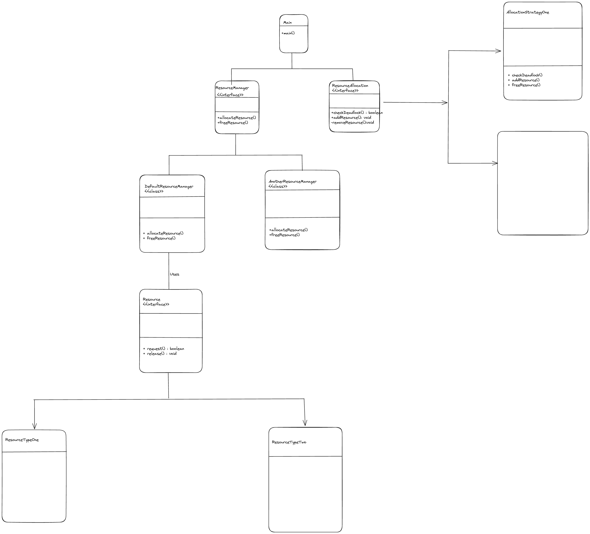

# Resource Management System
#multithreading #java #deadlockprevention

## Description of the Problem

- Consider a system where multiple threads need access to shared resources to perform their operations.
- Each thread may require one or more resources, and each resource can only be used by one thread at a time.
- The challenge is to design a system that allows threads to access resources as needed without leading to deadlocks or resource starvation.

## Major Concerns in this Problem

- **Deadlock**
    - Occurs when threads hold some resources while waiting for others, creating a cycle of dependencies that prevents any of them from proceeding.
- **Starvation**
    - Happens when one or more threads are perpetually denied access to the resources they need because other threads monopolize these resources.
- **Concurrency**
    - Involves managing the simultaneous access to shared resources efficiently and safely, ensuring system stability and performance.

## Why are there so many solutions

- The problem is an abstraction of real-life issues encountered in managing shared resources in concurrent software systems.
- It serves as an excellent case study to explore various synchronization and concurrency control mechanisms.
- Each solution emphasizes different techniques and compromises for managing access to shared resources.

### Resource Allocation Strategies
- Focuses on controlling how resources are allocated to prevent deadlocks and ensure fair access.

### Deadlock Prevention
- Aims to design the system in such a way that deadlocks are inherently impossible by eliminating one or more necessary conditions for a deadlock.

### Fairness and Avoiding Starvation
- Ensures that all threads have equitable access to resources, preventing any thread from being indefinitely blocked from resource access.

## Class Diagram and Package Structure

### Class Diagram
- 

### Package Structure

```lua 
- ResourceManagement/
  - core
    - Resource.java
    - ThreadEntity.java
  - allocation
    - ResourceAllocation.java
    - impl
      - ResourceAllocationStrategy.java
      - AllocationGraph.java
  - manager
    - ResourceManager.java
    - DefaultResourceManager.java
  - main
    - Main.java
```

- Explaining Package Structure
    - **Core**
        - Holds the fundamental entities like `Resource` and `ThreadEntity`.
    - **Allocation**
        - Encapsulates the logic for allocating resources, including the graph-based strategy and its implementation.
    - **Manager**
        - Contains classes responsible for the overall management of resources, interfacing between the threads and the allocation strategies.
    - **Main**
        - Serves as the entry point, setting up the system and demonstrating its operation.

## Implementation Notes

- **Resource Interface** - Defines the contract for resources within the system, ensuring thread-safe access.
- **ThreadEntity Class** - Represents threads or processes that require resource access.
- **ResourceAllocationStrategy Class** - Implements the `ResourceAllocation` interface using a graph-based approach to manage and allocate resources efficiently, avoiding deadlocks.
- **AllocationGraph Class** - Manages the graph structure used in deadlock detection, supporting the addition and removal of edges, and cycle detection.
- **DefaultResourceManager Class** - Orchestrates resource allocation by interacting with the `ResourceAllocationStrategy`, handling requests, and releases from threads.

## Working towards a Solution

- Begin by defining the basic behaviors for resources and threads.
- Implement the `ResourceAllocationStrategy` to manage resource allocation requests and detect potential deadlocks using a directed graph.
- The strategy ensures resources are allocated only when it's safe to do so, preventing deadlock conditions.
- The `DefaultResourceManager` acts as the intermediary, coordinating between threads requesting resources and the allocation strategy.

This README outlines the structure and intentions behind a resource management system designed to solve concurrency issues similar to those exemplified by the Dining Philosophers problem but applicable to a broader range of multithreaded systems.
The graph-based resource allocation strategy is central to this solution, offering a novel approach to deadlock prevention and resource management in complex software systems.